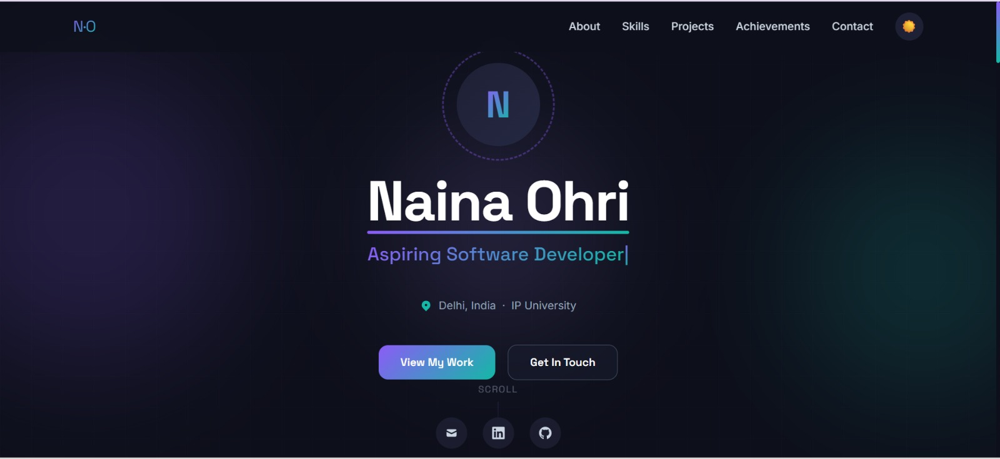
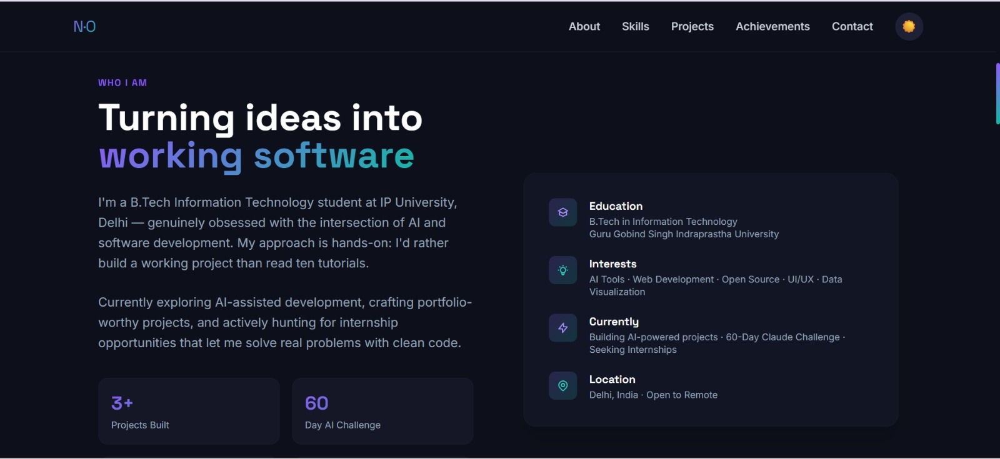
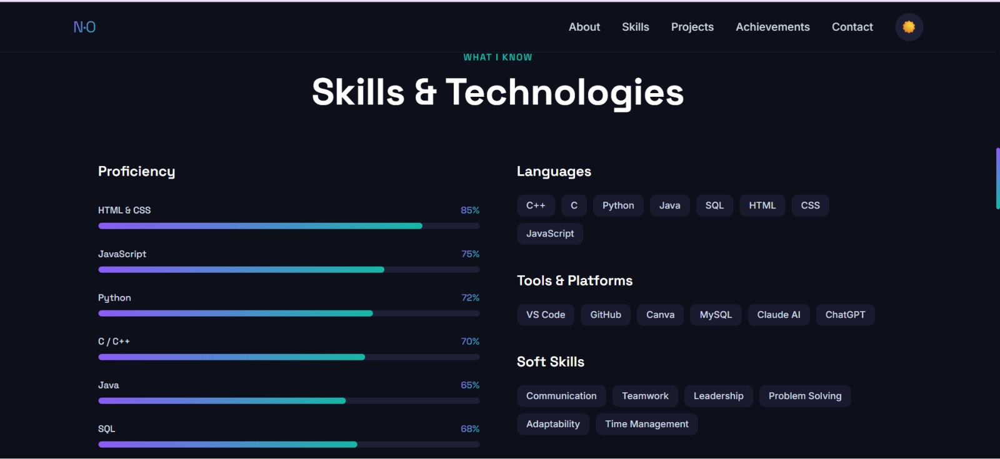
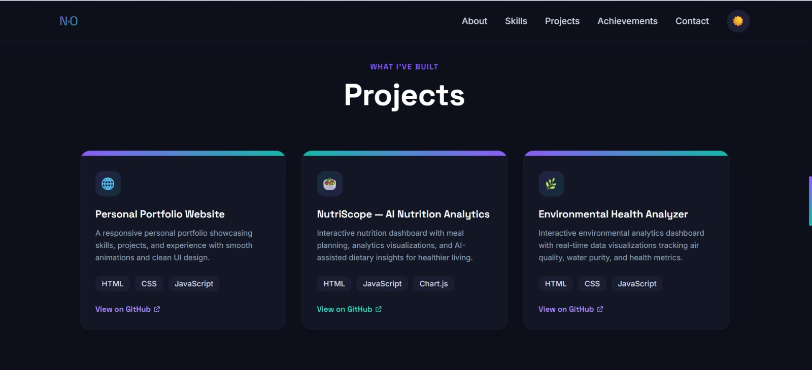
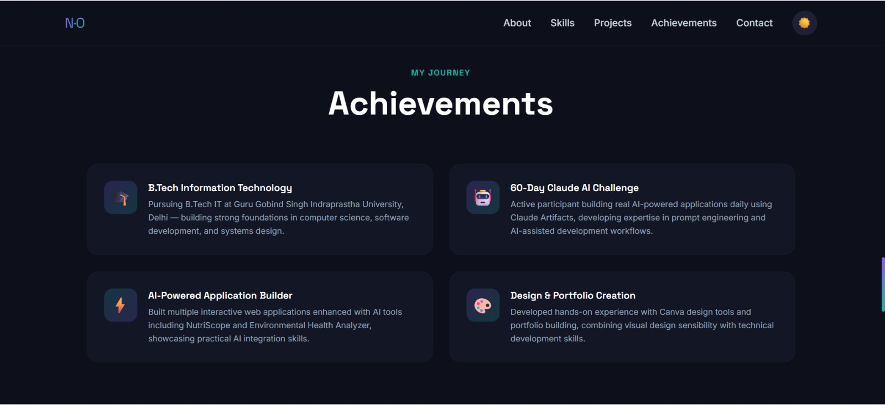
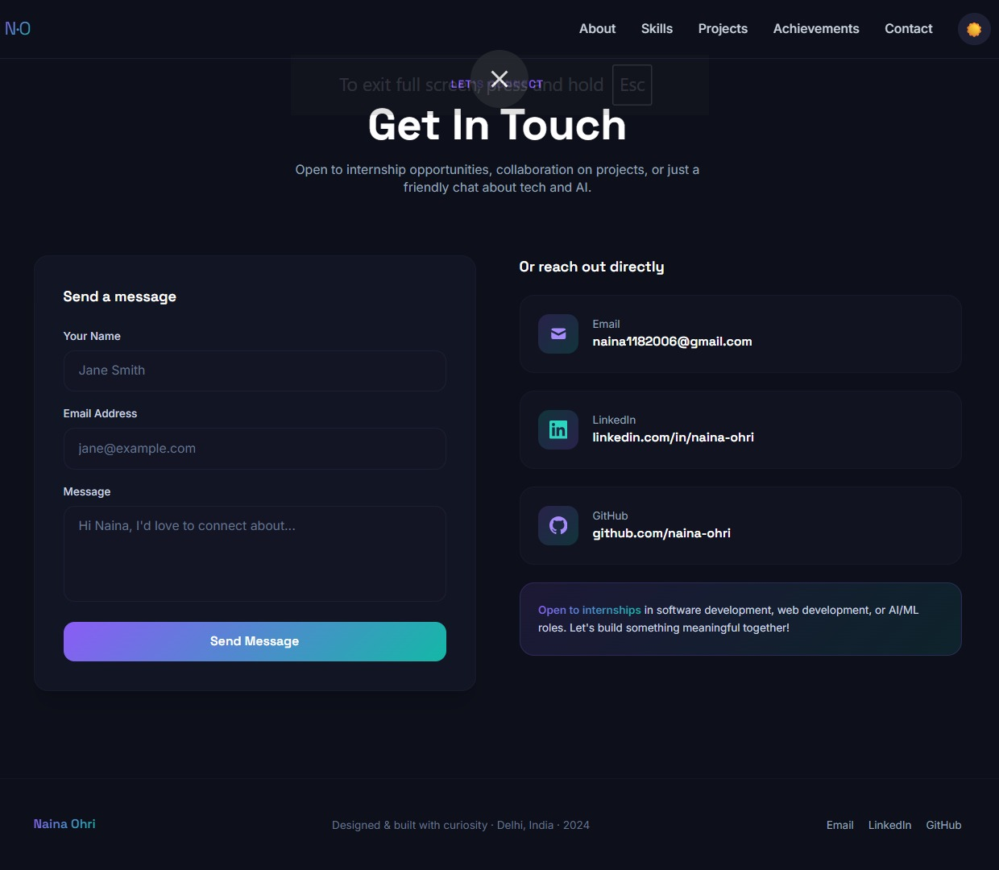
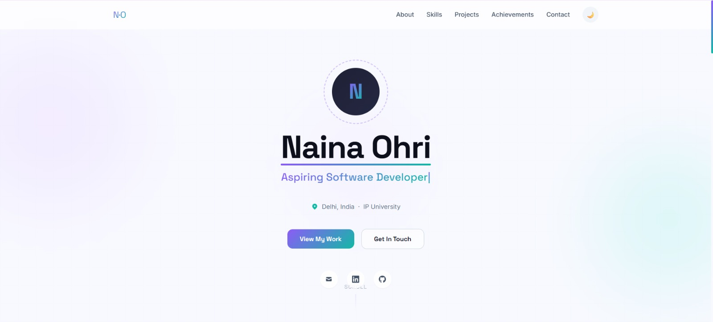
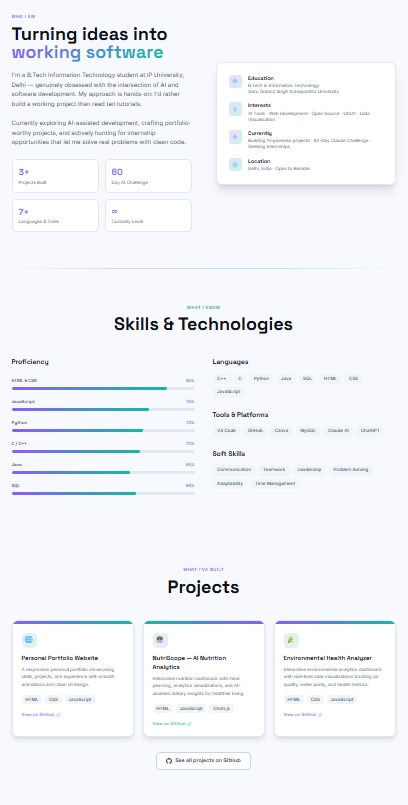
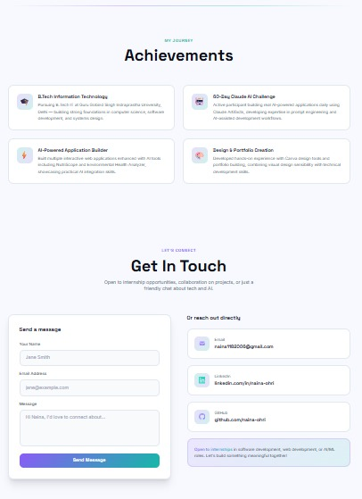

# Day 10 – Personal Portfolio Website

## Objective

The goal of this project was to learn how AI can be used to create a professional personal portfolio website without manually writing code.

The project focused on personal branding, showcasing skills and projects, improving professional visibility, and creating a recruiter-friendly online presence using Claude.

---

# Project Overview

A modern single-page personal portfolio website was created using Claude.

The portfolio showcases personal information, skills, projects, achievements, certifications, and contact details in a professional and visually appealing format.

The website was generated as a single HTML file using:

* HTML
* Tailwind CSS (CDN)
* Vanilla JavaScript

The design includes dark/light mode support, responsive layouts, animations, and modern portfolio sections.

---

# Portfolio Features

## Hero Section

* Name and professional title
* Animated typing effect cycling through multiple roles
* Social media links
* Call-to-action buttons
* Modern landing page design

## Typing Animation

The portfolio dynamically cycles through multiple roles such as:

* B.Tech IT Student
* Aspiring Software Developer
* AI & Web Development Enthusiast
* Problem Solver

This makes the portfolio feel more dynamic and engaging compared to displaying a single static title.

## About Me

Includes:

* Personal introduction
* Educational background
* Career aspirations
* Professional interests

## Skills & Technologies

### Technical Skills

* C++
* Java
* Python
* SQL
* HTML
* CSS
* JavaScript

### Tools

* VS Code
* Git & GitHub
* Canva
* MySQL

### Soft Skills

* Communication
* Leadership
* Problem Solving
* Teamwork

## Projects Section

Showcases personal projects using modern project cards.

Each card contains:

* Project title
* Project description
* Technology stack
* Professional presentation layout

## Achievements & Certifications

Highlights:

* Academic achievements
* Certifications
* Technical learning milestones
* Professional accomplishments

## Contact Section

Includes:

* Email
* LinkedIn
* GitHub
* Contact form

## Additional Features

* Dark Mode
* Light Mode
* Mobile Responsive Design
* Smooth Scroll Navigation
* Active Navigation Highlighting
* Modern UI Design
* Tailwind CSS Styling
* Recruiter-Friendly Layout
* SEO Meta Tags

---

# Portfolio Screenshots

## Dark Mode

### Homepage – Role 1

### Homepage – Role 2

### About Me Section

### Skills & Technologies

### Projects Section

### Achievements Section

### Contact Section

---

## Light Mode

### Light Mode Overview 1

### Light Mode Overview 2

### Light Mode Overview 3

---

# Files Included

## HTML File

* portfolio-website.html

## Screenshots Folder

### Dark Mode Screenshots

* screenshots/darkmode-homepage-role1.jpeg
* screenshots/darkmode-homepage-role2.jpeg
* screenshots/darkmode-about.jpeg
* screenshots/darkmode-skills.jpeg
* screenshots/darkmode-projects.jpeg
* screenshots/darkmode-achievements.jpeg
* screenshots/darkmode-contact.jpeg

### Light Mode Screenshots

* screenshots/light-mode-1.jpeg
* screenshots/light-mode-2.jpeg
* screenshots/light-mode-3.jpeg

## Live Portfolio URL

Not deployed (optional)

---

# Key Learnings

## 1. Personal Branding Matters

A portfolio is more than a collection of projects. It acts as a professional identity and creates a strong first impression for recruiters and employers.

## 2. AI Can Accelerate Web Development

Claude was able to generate a complete portfolio website including layout, styling, animations, responsiveness, and interactive features in a single prompt.

## 3. Dynamic Content Improves User Experience

Using a typing animation that cycles through multiple roles makes the portfolio more engaging and visually appealing than displaying one static title.

## 4. Responsive Design Is Essential

A portfolio should work seamlessly across desktop, tablet, and mobile devices to ensure accessibility for all visitors.

## 5. Professional Presentation Increases Credibility

Well-structured sections, modern design, and clear navigation improve the overall professional appearance of a portfolio.

---

# Conclusion

This project demonstrated how AI can be used to quickly build professional portfolio websites without manually writing large amounts of code.

The generated portfolio successfully showcases skills, projects, achievements, and contact information while maintaining a modern and recruiter-friendly design.

The experience highlighted the importance of personal branding and how AI tools like Claude can accelerate the creation of professional online portfolios.

#60DayClaudeChallenge

